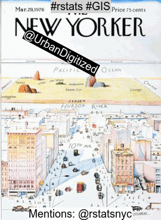

```{r setup,  include=FALSE}
knitr::opts_chunk$set(echo = FALSE, message=FALSE, warning=FALSE)
#library(raster)
library(tidyverse)
library(flexdashboard)
library(rtweet)
library(rgdal)
library(lubridate)
library(highcharter) # better than ggplot2. sorry not sorry
### i don't even remember which of these packages I ended up using...
library(tm)
library(SnowballC)
library(RColorBrewer)
library(wordcloud)
library(ngram)
library(cld2)
library(purrr)
library(printr)

source("R/credentials.R")
source("R/TwitterDashboard_functions.R")


```


```{r set_params}
MIN_DATE_TS='2020-08-13'
MIN_DATE='2020-08-10'
tag = 'rstatsnyc'   # what tweets to grab
max.tweets = 5000   # at most how many?

stopWords <- stopwords("en")

dcrPalette <- c("#9D1C1E", "#E0B1AF", "#C06C74","#E2E1E4", "#181515", "#D49E97")


```


<style>
@import url('https://fonts.googleapis.com/css?family=Nanum+Gothic|Quicksand');
</style>


```{r get_basics, message=FALSE, warning=FALSE}

##### GET THE TWEETS
rstats_tweets <- get_tweets.fun(tag=tag, max.tweets=max.tweets)
rstats_tweets <-rstats_tweets %>% filter(created_at>=MIN_DATE)

##### SUCCESS METRIC # 1 / SCOREBOARD 1
user_count<- rstats_tweets  %>% 
  filter(!(screen_name %in% exclude_screen_name_list) ) %>% 
  group_by(screen_name) %>%
  summarize(  n=n()
            , retweets=length(is_retweet[is_retweet==TRUE])
            , original_tweets=length(is_retweet[is_retweet==FALSE])) %>% 
  arrange(desc(n)) 


##### SUCCESS METRIC # 2  / SCOREBOARD 2

user_all_words <- prep_metrics_for_composite_score.fun(rstats_tweets, exclude_screen_name_list )
```


 #rstatsnyc
=====================================


 

</br>


Row
-------------------------------------

### Total Tweets {data-width=200}


```{r}
valueBox(nrow(rstats_tweets) , icon="fa-twitter"
)

```


### User Count {data-width=200}


```{r}
valueBox(length(unique(rstats_tweets$screen_name)) , icon="fa-user"
)
```

### SCOREBOARD #1 : 
<center><font color="#9D1C1E">Contribution & Engagement</font></center>

```{r}
scoreboard1 <- user_all_words %>% 
  rename(Handle=screen_name) %>% 
  dplyr::select(Handle ,`Contribution & Engagement` ) %>%  arrange(desc(`Contribution & Engagement` )) %>%
  rename(Score= `Contribution & Engagement` ) %>%
  slice(1:5)
scoreboard1

```


### SCOREBOARD #2: 
<center><font color="#9D1C1E">Total Tweets</font></center>

```{r}
scoreboard <- user_count %>%  
  rename(Handle=screen_name,  `Total Tweets` = n , Retweets=retweets, `Original Tweets` = original_tweets) %>% 
  dplyr::select(Handle ,  `Total Tweets` ) %>% slice(1:5)
scoreboard
```


### SCOREBOARD #3 : 

<center><font color="#9D1C1E">Dedicated Small Players</font></center>

```{r}
scoreboard2 <- user_all_words %>% 
  rename(Handle=screen_name) %>% 
  dplyr::select(Handle ,`Dedicated Small Players` ) %>%  arrange(desc(`Dedicated Small Players` )) %>%
  rename(Score= `Dedicated Small Players` ) %>%
  slice(1:5)
scoreboard2

```


Row {data-height=70}
-------------------------------------


<h3> What we're Tweeting </h3>
 

Row {data-height=400}
-------------------------------------

### Shared on Twitter





### Wordclouds : Unigram  & Bigram

<center>
```{r}
nc_1<-ngram.fun(rstats_tweets,1)
nc_2<-ngram.fun(rstats_tweets,2)
#nc_3<-ngram.fun(rstats_tweets,3)
# side by side wordclouds
opar <- par()   
par(mfrow=c(1,2), mar=c(1, .5, 0, 0) )# margins: bottom, left, top,right 
wordcloud(nc_1$ngrams,nc_1$freq,max.words=200,random.order = F,  colors=dcrPalette)
wordcloud(nc_2$ngrams,nc_2$freq,max.words=200,random.order = F,  colors=dcrPalette)
#wordcloud(nc_3$ngrams,nc_3$freq,max.words=100,random.order = F, colors=brewer.pal(8, "Dark2"))

```
</center>


Row {data-height=70}
-------------------------------------


<h3> Tweet Timeline </h3>
 
 
Row
-------------------------------------
 

### Tweets Over Time


```{r, message=FALSE, warning=FALSE}
#rstats_tweets$created_at_EST<-format(pb.date, tz="America/New_York",usetz=TRUE)
rstats_tweets$hour<-floor_date(rstats_tweets$created_at, "15 mins")
hour_count<- rstats_tweets %>% filter(created_at>=MIN_DATE_TS) %>% #group_by(hour) %>%
   count(hour) #mutate( n=as.integer(n)) 
  
highchart()%>% 
hc_add_series_times_values(hour_count$hour ,hour_count$n, showInLegend=FALSE, name="Tweet Count: ") %>% 
   hc_xAxis( title=list(text="")) %>%
   hc_yAxis(title=list(text="Tweet Count") ) %>%
  # hc_tooltip(useHTML = TRUE,  pointFormat = hour_count_tooltip) %>% 
   hc_title(text='DCR Tweets Per 15 Minutes') %>% 
  hc_colors(dcrPalette)

```


Row {data-height=70}
-------------------------------------


<h3> Top 25 Tweeters (Total Tweets) </h3>


Row {data-height=600}
-------------------------------------


### Top 25

```{r, message=FALSE, warning=FALSE}
# resetting par() to it's original state after modifying it for side-by-side wordclouds
par(opar)

x <- c("Handle", "Tweet Count ", "Original Tweets ", "Retweets " )
y <- sprintf("{point.%s}", c("screen_name","n", "original_tweets", "retweets"))
user_count_tooltip <- tooltip_table(x, y)
# if you get errors here, remove the quotes from both hcaes() arguments.  Then complain to Hadley.
hchart(user_count[1:25,], "bar",hcaes("screen_name" ,"n")) %>%
   hc_xAxis(title=list(text="Twitter Handle"), labels=list(style=list(fontsize=14, color="slategrey")) ) %>%
   hc_yAxis(title=list(text="Tweet Count") ) %>%
   hc_tooltip(useHTML = TRUE, headerFormat = "", pointFormat = user_count_tooltip) %>% 
   hc_title(text=paste0('NYR #',tag, ' Total Tweets')) %>% hc_size(height=600)%>% 
  hc_colors(dcrPalette[3])
```

 
Row {data-height=70}
-------------------------------------


<h3> But... are they original? </h3>

Row {data-height=600}
-------------------------------------


### Original VS Retweet Breakdown
```{r}
x <- c("Handle", "Tweet Count ", "Original Tweets " )
y <- sprintf("{point.%s}", c("screen_name","n", "original_tweets"))
user_count_tooltip <- tooltip_table(x, y)
user_count$screen_name<-as.character(user_count$screen_name)
user_count<- user_count %>% arrange(desc(original_tweets))
# force it to stay in the original order rather than ordered by the first series, retweets
user_count$screen_name<-factor(user_count$screen_name, levels=unique(user_count$screen_name))
 highchart() %>%
    hc_add_series( user_count[1:25,], "bar",hcaes("screen_name" ,"retweets"), name="Retweets") %>%
   hc_add_series(user_count[1:25,], "bar",hcaes("screen_name" ,"original_tweets"), name="Original Tweets") %>%
  
  
   hc_xAxis( title=list(text=""), labels=list(style=list(fontsize=14, color="slategrey")) , type="category") %>%
   hc_yAxis(title=list(text="Tweet Count") ) %>%
   hc_tooltip(useHTML = TRUE, headerFormat = "", pointFormat = user_count_tooltip) %>% 
   hc_title(text=paste0('NYR #',tag, ' Original VS Retweet Count')) %>% hc_plotOptions(bar=list(stacking="normal")) %>% hc_size(height=600) %>% 
  hc_colors(dcrPalette)
  #%>% hc_legend(align = "right", verticalAlign = "top", layout = "vertical") 
  
  user_count<- user_count %>% arrange(desc(original_tweets))
```

Row {data-height=10}
-------------------------------------


<div class="footer">
  <p> Updated `r Sys.time()` |  maloriejhughes@gmail.com | @data_all_day  </p>
</div>
  


Mash-up Metric Details
=====================================


<h3>  Contribution & Engagement  </h3> 

 


$$:= I_{n_O>0}\times \frac{4RT + L}{\sqrt{F}+1} + \frac{3p + 2m + h}{.25n_O + n_{RT} + 1}$$


<h3>Dedicated Small Players </h3> 


$$:= \frac{3p + 2m + h }{I_{F\leq500}+I_{f>500}\sqrt{F-500}}$$

where, 

$RT$ : retweeted by others

$L$ : liked by others

$F$ : followers

$p$ : number of images/media/urls

$m$ : number of users mentioned (@)

$h$ : number of hashtags (#)

$n_{RT}$ : number of retweets shared by you

$n_O$ : number of original tweets

         

```{r}
# an ode to my first composite metric
# `Mash-up Metric` = (4*retweeted_by_others + 2*liked_by_others + original_tweets + .5*retweets )/log(followers) 
  #        + (num_photos + num_users_mentions + num_hashtags)
    
```


```{r}
library(DT)

user_all_words%>% 
  dplyr::select(screen_name, `Contribution & Engagement`
                , `Dedicated Small Players`
         , original_tweets 
         , retweets
         , retweeted_by_others
         , liked_by_others
         , followers
         , num_photos 
         , num_users_mentions 
         , num_hashtags
          ) %>% datatable( options = list( columnDefs = list(list(width = '70px')),
  searchHighlight = TRUE,pageLength = 100, fixedColumns = list(leftColumns = 1)))
```


<div class="footer">
  <p> Updated `r Sys.time()` |  maloriejhughes@gmail.com | @data_all_day  </p>
</div>
  
